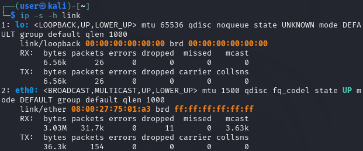

# ETHICAL HACKING - AUTONOMIE

Yannick COUSIN

---

## 1 - La commande IP

1.
 
```bash
ip a 
```
 
La commande ci dessus permet d'obtenir les informations générales de toutes les interfaces de la machine. Sans autres option, on a déjà les IP (v4 et v6) les adresses MAC, les valeurs de MTU, les states des interfaces (UP/DOWN) et les adresses de broadcast

2. Mon interface **"eth0"** a l'adresse MAC : "**08:00:27:75:01:A3**"

3. Le constructeur de ma carte est : "**PCS Systemtechnik GmbH**"

4. "**lo**" est l'interface de loopback (localhost) de ma machine.

5. Sur "**eth0**" , mon IP est : "**192.168.10.72**"

6. Avec l'option "**-s**" de la commande ip, on peut afficher des statistiques détaillées.
Cependant, il s'agit d'information sur les **paquets** échangés, et non pas sur les trames !
La commande IP ne permet pas d'avoir plus d'infos sur les trames. Il faut utiliser d'autre(s) utilitaires pour cela. 
J'ai donc **31 700** paquets reçus et **154** pacquets envoyés.
De plus, je suis en full-duplex, donc aucune collision.





---

## 2- Wireshark

1. L'espérluette ("**&**") permet de lancer un processus en background.
Le processus sera executé en arrière plan permettant à l'utilisateur de récupérer la main dans son terminal même pendant l'exécution.
Si par contre on quitte le terminal, le processus sera fermé avec (car le terminal est le processus parent qui lance wireshark ou d'autres commandes).
Pour éviter ça, on peut en complément utiliser la commande **nohup**, exemple :

```bash
nohup wireshark &
```

2. **DISPLAY=:0.0** affecte **":0.0"** à la variable d'environnement **DISPLAY**.
Par défaut sur mon système, c'est déjà la valeur par défaut.
Le format de cette variable est : **[host]:<display>[.screen]**
Si "host" n'est pas renseigné, comme ici, ça désigne la machine locale.
Chaque hôte peux avoir plusieurs display, et chaque display peut avoir plusieurs écrans.

Dans mon cas, comme c'est déjà la valeur par défaut, il n'est pas nécessaire de lancer wireshark en définissant cette variable.
De plus, c'est une option en général qui est plutôt utilisé sur des environnement distants.

3. Concernant le certificat SSL/TLS de ecolepratique.com : Ce dernier est bien valide, mais la chaîne de certificats n'est pas complète ! Ainsi, les navigateurs modernes comblent les infos manquantes de CA Root et intermediate cert, mais wget ne comble rien du tout et affiche une erreur.
Je préconise au mainteneur du site de configurer le certificat présenté avec la chaine entière que voici :

```
-----BEGIN CERTIFICATE-----
MIIGYDCCBUigAwIBAgIQAszAme3mmIveujYrKusNMjANBgkqhkiG9w0BAQsFADBe
MQswCQYDVQQGEwJVUzEVMBMGA1UEChMMRGlnaUNlcnQgSW5jMRkwFwYDVQQLExB3
d3cuZGlnaWNlcnQuY29tMR0wGwYDVQQDExRUaGF3dGUgVExTIFJTQSBDQSBHMTAe
Fw0yNDA5MTgwMDAwMDBaFw0yNTEwMTAyMzU5NTlaMFExCzAJBgNVBAYTAkZSMRIw
EAYDVQQHEwlNQVJTRUlMTEUxEDAOBgNVBAoTB0NDSU1BTVAxHDAaBgNVBAMMEyou
ZWNvbGVwcmF0aXF1ZS5jb20wggEiMA0GCSqGSIb3DQEBAQUAA4IBDwAwggEKAoIB
AQC68f+EIBB60X/0bcPBI5pjElaCDdkp376HMqmFtWVrF2MeV5XFPg93vG1HV6xg
VvUk7qlYkIA9Nn2+XazkGrVA3qVIaV2j0PJOwTcXDgMK0igTCIp5YuZhHr9PSTjo
F+CNh5GBW7DBr8dni1xR66602he2+uR5dwY5HE/r+sqhvAqjwqSaA63kzMucRWZc
y7qan6rNNrjizJQhMLhec0Hj1elqD4gJnT124kvoRjOWApt1nl3fokcoAmsZZUrG
xx8j+QtuvTtNdNolP3LL3G5VfgGVCvqOgusLZlnz20K91nwJCglUgUZSXLEKt050
+N2/+EZvS+V2XwiJn9C5dHv9AgMBAAGjggMlMIIDITAfBgNVHSMEGDAWgBSljP4y
zOsPLNQZxgi4ACSIXcPFtzAdBgNVHQ4EFgQUV2kLyjvLYDwTHGnPynddjdPw+QIw
MQYDVR0RBCowKIITKi5lY29sZXByYXRpcXVlLmNvbYIRZWNvbGVwcmF0aXF1ZS5j
b20wPgYDVR0gBDcwNTAzBgZngQwBAgIwKTAnBggrBgEFBQcCARYbaHR0cDovL3d3
dy5kaWdpY2VydC5jb20vQ1BTMA4GA1UdDwEB/wQEAwIFoDAdBgNVHSUEFjAUBggr
BgEFBQcDAQYIKwYBBQUHAwIwOwYDVR0fBDQwMjAwoC6gLIYqaHR0cDovL2NkcC50
aGF3dGUuY29tL1RoYXd0ZVRMU1JTQUNBRzEuY3JsMHAGCCsGAQUFBwEBBGQwYjAk
BggrBgEFBQcwAYYYaHR0cDovL3N0YXR1cy50aGF3dGUuY29tMDoGCCsGAQUFBzAC
hi5odHRwOi8vY2FjZXJ0cy50aGF3dGUuY29tL1RoYXd0ZVRMU1JTQUNBRzEuY3J0
MAwGA1UdEwEB/wQCMAAwggF+BgorBgEEAdZ5AgQCBIIBbgSCAWoBaAB2ABLxTjS9
U3JMhAYZw48/ehP457Vih4icbTAFhOvlhiY6AAABkgOT7bYAAAQDAEcwRQIhAJRE
SC2M/xc6NMt9iSBIo+63VGxHmsirxoi1tTmPvc28AiBcNC86BmhzbSJVe9y8gqYC
TSjRTxaCSI/zrtTLrdT1OwB2AH1ZHhLheCp7HGFnfF79+NCHXBSgTpWeuQMv2Q6M
Lnm4AAABkgOT7awAAAQDAEcwRQIgMThORNo0BcL0oElGFp7shNIDn5mwjw37CIoc
5NZhoTMCIQDiIJs/Hog9+vo0XUEFNHAWkTxJneDCmUhxkONh/ToQcQB2AObSMWNA
d4zBEEEG13G5zsHSQPaWhIb7uocyHf0eN45QAAABkgOT7b0AAAQDAEcwRQIhAOHD
Rf0QnYbhrGVkfgomfEMB3OYszGWWFQRKpip8XENyAiALhMFfgToKzusSe9yY42h5
TgFg3ICpCq8qeOYyrfqQGjANBgkqhkiG9w0BAQsFAAOCAQEAc0qAD6Psms8yhfnA
GJ/m0+4yDD+Bl7VbAi+46Sc6pX7sfY8B5C4ShjwLM5GafwvHmSTt/en5Ax4PzNxX
ezXlBoy9qIrQGh4227yKepbWkyA7UXwH+ylqskSfI7IqaoeMUxW9lD/reu3w3FpC
P1MEwJE5zHOT9crJsS9Crnxnl8UiFn6kOqRIQDNjqMbiCSTCPTbIv5iuj/NGotQe
Nw4LeSHCYcXsPt4WqY2avcV7UI7GDUZcLdKslGJ02o9ALG5vysDviMtFsFcvs+CJ
UBOLuZFnZ/fHaXbiCm9GNp2qektkC6B6Uxz+8at3z/+s06p8+KKoyumQwRqO7ZRP
tkaG1Q==
-----END CERTIFICATE-----
-----BEGIN CERTIFICATE-----
MIIEizCCA3OgAwIBAgIQCQ7oxd5b+mLSri/3CXxIVzANBgkqhkiG9w0BAQsFADBh
MQswCQYDVQQGEwJVUzEVMBMGA1UEChMMRGlnaUNlcnQgSW5jMRkwFwYDVQQLExB3
d3cuZGlnaWNlcnQuY29tMSAwHgYDVQQDExdEaWdpQ2VydCBHbG9iYWwgUm9vdCBH
MjAeFw0xNzExMDIxMjI0MjVaFw0yNzExMDIxMjI0MjVaMF4xCzAJBgNVBAYTAlVT
MRUwEwYDVQQKEwxEaWdpQ2VydCBJbmMxGTAXBgNVBAsTEHd3dy5kaWdpY2VydC5j
b20xHTAbBgNVBAMTFFRoYXd0ZSBUTFMgUlNBIENBIEcxMIIBIjANBgkqhkiG9w0B
AQEFAAOCAQ8AMIIBCgKCAQEAxjngmPhVetC0b/ozbYJdzOBUA1sMog47030cAP+P
23ANUN8grXECL8NhDEF4F1R9tL0wY0mczHaR0a7lYanlxtwWo1s2uGnnyDs6mOCs
66ew2w3YETr6Tb14xgjpu1gGFtAeewaikO9Fud8hxGJTSwn8xeNkfKVWpD2L4vFN
36FNgxeilK6aE4ykgGAzNlokTp6hNOLAYpDySdLAPKzuJSQ7JCEZ6O+SDKywIdXL
oMTnpxuBKGSG88NWTo3CHCOGmQECia2yqdPDjgLqnEiYNjwQL8uMqj8rOvlMgviB
cHA7xty+7/uYLN6ZS7Vq1/F/lVhVOf5ej6jZdmB85szFbQIDAQABo4IBQDCCATww
HQYDVR0OBBYEFKWM/jLM6w8s1BnGCLgAJIhdw8W3MB8GA1UdIwQYMBaAFE4iVCAY
lebjbuYP+vq5Eu0GF485MA4GA1UdDwEB/wQEAwIBhjAdBgNVHSUEFjAUBggrBgEF
BQcDAQYIKwYBBQUHAwIwEgYDVR0TAQH/BAgwBgEB/wIBADA0BggrBgEFBQcBAQQo
MCYwJAYIKwYBBQUHMAGGGGh0dHA6Ly9vY3NwLmRpZ2ljZXJ0LmNvbTBCBgNVHR8E
OzA5MDegNaAzhjFodHRwOi8vY3JsMy5kaWdpY2VydC5jb20vRGlnaUNlcnRHbG9i
YWxSb290RzIuY3JsMD0GA1UdIAQ2MDQwMgYEVR0gADAqMCgGCCsGAQUFBwIBFhxo
dHRwczovL3d3dy5kaWdpY2VydC5jb20vQ1BTMA0GCSqGSIb3DQEBCwUAA4IBAQC6
km0KA4sTb2VYpEBm/uL2HL/pZX9B7L/hbJ4NcoBe7V56oCnt7aeIo8sMjCRWTCWZ
D1dY0+2KZOC1dKj8d1VXXAtnjytDDuPPf6/iow0mYQTO/GAg/MLyL6CDm3FzDB8V
tsH/aeMgP6pgD1XQqz+haDnfnJTKBuxhcpnx3Adbleue/QnPf1hHYa8L+Rv8Pi5U
h4V9FwHOfphdMXOxi14OqmsiTbc5cOs9/uukH+YVsuFdWTna6IVw1qh+tEtyH16R
vmi7pkqyZYULOPMIE7avrljVVBZuikwARtY8tCVV6Pp9l3VeagBqb2ffgqNJt3C0
TYNYQI+BXG1R1cABlold
-----END CERTIFICATE-----
```

5. L'adresse MAC de la machine qui a envoyé les données http est **68:3A:1E:43:BF:71** :


6. Les 2 nombres séparés d'une flèche dans la colonne "Info" sont respectivements le port source et le port destination de la trame concernée.

7. Voici quelques protocoles qui apparaissent dans wireshark lors de cette capture :

 - **TCP : Transmission Control Protocol**, conçu pour envoyer des paquets sur internet et assurer la bonne transmission des données (Three way handshake : SYN, SYN/ACK, ACK)
 
 - **TLSv1.3 : Transport Layer Security Version 3**, permet de sécuriser les échanges en authentifiant le serveur, en assurant la confidentialité des données échangées (chiffrement), en assurant l'intégrité des données échangées, et parfois même l'authentification client.

---
 
## 3 - Etude d'un fichier pcap

1. 

2. Le filtre en question est composé de 2 parties qui doivent être vrai ( de part et d'autre du "and" ). La 1ere partie fait référence à toutes les trames qui font référence à une requête **HTTP** OU qui font références à un **TLS Hello Request** (TLS Handshake type 1)
La 2eme partie exclut toutes les trames liées à SSDP (Simple service discovery protocol) qui est un protocole de découverte de services réseau local.

3. Voici le filtre à utiliser : 
```
http.request.method==GET and http.request.uri contains ".php"
```
4. Il y a un énorme bloc stocké en binaire qu'on ne peut donc pas voir et ce bloc de code est sauvegardé dans un fichier '0217_2857682888090.doc'.

---

## 4 - Rapport d'analyse de traffic

### Executive Summary

Le Mardi 26/11/2024, une machine Windows a été infecté par un malware depuis **"modandcrackedapk.com"** ou **http://194.180.191.64/fakeurl.htm**

### Victime

 - IP : **10.11.26.183**
 - Mac : **D0:57:7B:CD:FC:8B**
 - Hostname : **DESKTOP-B8TQK49**
 - Nom : **Olivier Q.. Boomwald**
 - Username : oboomwald
 
Première requête vers modancrackedapk.com : le 26/11/24 à 04:50:14 UTC.

Puis requête vers 194.180.191.64 le 26/11/24 à 04:50:45 UTC.

Sur ce site, on peut voir que les requêtes sont en HTTP en clair sur le port 443, ce qui paraît frauduleux.

### Indicators of Compromise

 - Les Alertes de l'IP 194.180.191.164 matchent avec requête POST sur http://194.180.191.164/fakeurl.htm 
 - Je n'ai pas trouvé la preuve, mais vu la chronologie des evenements et le nom du site visité en premier lieu par l'utilisateur, il semblerait que ce dernier l'ai redirigé vers le RAT (modandcrackedapk.com)
 

 
